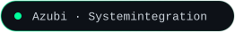
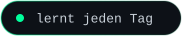
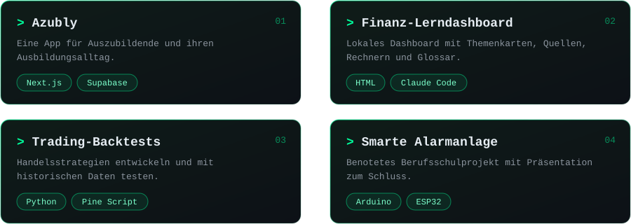

<p align="center">
  
</p>

<p align="center">
  
  
  
</p>

## `> about`

```python
class Snifted:
    role        = "Azubi Fachinformatiker Systemintegration"
    languages   = ["Deutsch", "English"]
    builds_with = ["Claude", "Claude Code"]
    loves       = ["KI-Tools", "Autos & Motorräder", "Video-Edits"]
    learning    = ["Python", "Next.js + Supabase", "Arduino / ESP32", "Trading-Backtests"]

    def motto(self):
        return "Ich baue mit KI und lerne dabei jeden Tag dazu."
```



## `> tools`

<p>
  
</p>

<p>
  
  
</p>

## `> projects`

<!--
  Sobald deine Repos öffentlich sind: Namen unten als Links eintragen,
  z. B. [Azubly](https://github.com/Snifted/azubly)
-->

<p align="center">
  
</p>


## `> core`

<p align="center">
  
</p>


## `> 3d`

<p align="center">
  
</p>


## `> links`

<p>
  <a href="https://www.youtube.com/@Snifted"></a>
</p>

<p align="center"><sub><code>$ echo "Danke fürs Vorbeischauen." &amp;&amp; exit 0</code></sub></p>
