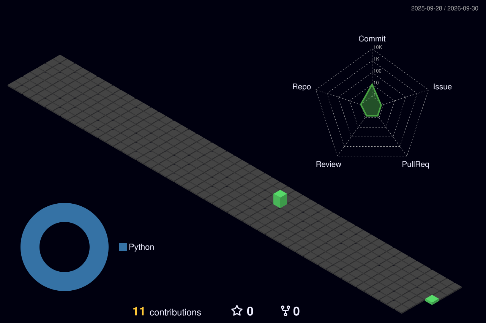

<p align="center">
  
</p>

<p align="center">
  
  
  
</p>

## `> about`

```python
class Snifted:
    role     = "Azubi Fachinformatiker Systemintegration"
    languages = ["Deutsch", "English"]
    loves    = ["Automatisierung", "Homelab", "sauberer Code", "Autos & Motorräder"]
    learning = ["Python", "Next.js + Supabase", "Arduino / ESP32", "Trading-Backtests"]

    def motto(self):
        return "Erst verstehen, dann automatisieren."
```

## `> stack`

<p>
  
</p>

## `> projects`

<!--
  Sobald deine Repos öffentlich sind: Namen unten als Links eintragen,
  z. B. [Azubly](https://github.com/Snifted/azubly)
-->

| Projekt | Beschreibung | Stack |
| :-- | :-- | :-- |
| **Azubly** | App für Auszubildende | Next.js · Supabase |
| **Finanz-Lerndashboard** | Lokales Dashboard mit Themenkarten, Rechnern und Glossar | HTML · JS |
| **Trading-Backtests** | Strategien entwickeln und testen | Python · Pine Script |
| **Smarte Alarmanlage** | Berufsschulprojekt mit Sensorik und Benachrichtigung | Arduino · ESP32 |

## `> 3d contributions`

<p align="center">
  
</p>

## `> links`

<p>
  <a href="https://www.youtube.com/@Snifted"></a>
</p>

<p align="center"><sub><code>$ echo "Danke fürs Vorbeischauen." &amp;&amp; exit 0</code></sub></p>
